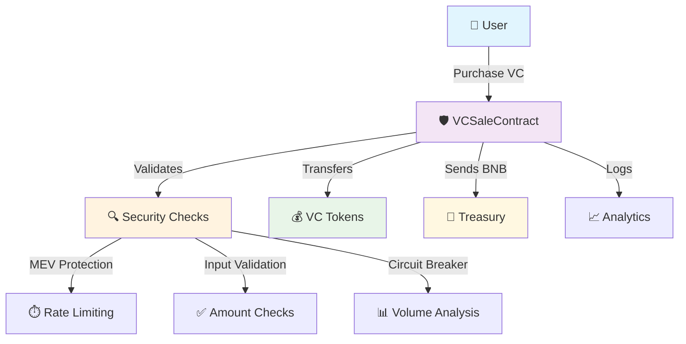

<div align="center">

# 🚀 VCSale Smart Contract

### *Production-Grade Token Sale Contract with Enterprise-Level Security*

[](https://choosealicense.com/licenses/mit/)
[](https://soliditylang.org/)
[](https://openzeppelin.com/)
[](https://owasp.org/)

[](https://github.com/TheMacroeconomicDao/unit-welcometask-smartcontract/commits)
[](https://github.com/TheMacroeconomicDao/unit-welcometask-smartcontract/stargazers)
[](https://github.com/TheMacroeconomicDao/unit-welcometask-smartcontract/network)

[📖 **Documentation**](#-documentation) | [🚀 **Quick Start**](#-quick-start) | [🔒 **Security**](#-security-features) | [🛠️ **Development**](#%EF%B8%8F-development) | [🤝 **Contributing**](#-contributing)

---

*Enterprise-grade smart contract for secure token sales on BSC with maximum security compliance*

</div>

## 🎯 **Overview**

VCSaleContract is a **production-ready**, **security-first** smart contract designed for conducting secure token sales. Built with **OWASP SC Top 10 (2025)** compliance and battle-tested patterns, it provides enterprise-grade protection against MEV attacks, reentrancy exploits, and various DeFi vulnerabilities.

### ✨ **Why VCSaleContract?**

- 🛡️ **Maximum Security**: OWASP SC Top 10 compliant with comprehensive attack protection
- ⚡ **MEV Protection**: Built-in safeguards against front-running and sandwich attacks
- 🔄 **Circuit Breaker**: Automatic protection against unusual trading patterns
- 👥 **RBAC System**: Role-based access control with principle of least privilege
- 📊 **Real-time Monitoring**: Comprehensive event logging and analytics
- 🔧 **Upgradeable**: UUPS proxy pattern for future improvements

## 🏗️ **Architecture**

<div align="center">



</div>

## 🌟 **Features**

<table>
<tr>
<td>

### 🛡️ **Security First**
- ✅ Reentrancy Protection
- ✅ MEV Attack Prevention  
- ✅ Input Sanitization
- ✅ Rate Limiting
- ✅ Circuit Breaker Pattern
- ✅ Emergency Pause

</td>
<td>

### ⚡ **Performance**
- ✅ Gas Optimized
- ✅ Batch Operations
- ✅ Efficient Storage
- ✅ Minimal External Calls
- ✅ Smart Caching
- ✅ Optimized Calculations

</td>
</tr>
<tr>
<td>

### 👥 **Access Control**
- ✅ Role-Based Permissions
- ✅ Admin Separation
- ✅ Multi-Sig Compatible
- ✅ Granular Controls
- ✅ Emergency Powers
- ✅ Audit Trail

</td>
<td>

### 📊 **Monitoring**
- ✅ Comprehensive Events
- ✅ Real-time Analytics
- ✅ User Statistics
- ✅ Sales Tracking
- ✅ Performance Metrics
- ✅ Security Alerts

</td>
</tr>
</table>

## 🚀 **Quick Start**

### Prerequisites

```bash
# Node.js v18+
node --version

# Hardhat
npm install --global hardhat

# Git
git --version
```

### Installation

```bash
# 1️⃣ Clone the repository
git clone https://github.com/TheMacroeconomicDao/unit-welcometask-smartcontract.git
cd unit-welcometask-smartcontract

# 2️⃣ Install dependencies
npm install

# 3️⃣ Set up environment
cp .env.example .env
# Edit .env with your configuration

# 4️⃣ Compile contracts
npm run compile

# 5️⃣ Run tests
npm run test
```

### Deployment

```bash
# Deploy to BSC Testnet
npx hardhat run scripts/deploy-vcsale.js --network bscTestnet

# Deploy to BSC Mainnet (Production)
npx hardhat run scripts/deploy-vcsale.js --network bscMainnet
```

## 💻 **Usage Example**

```solidity
// SPDX-License-Identifier: MIT
pragma solidity ^0.8.19;

import "./contracts/VCSaleContract.sol";

contract ExampleUsage {
    VCSaleContract public vcsale;
    
    function purchaseTokens(uint256 vcAmount) external payable {
        // Calculate required BNB
        uint256 requiredBNB = vcsale.calculateBNBAmount(vcAmount);
        
        // Purchase VC tokens
        vcsale.purchaseVC{value: requiredBNB}(vcAmount);
    }
    
    function getSaleInfo() external view returns (
        uint256 totalSold,
        uint256 available,
        uint256 pricePerVC,
        bool isActive
    ) {
        (
            ,
            totalSold,
            available,
            pricePerVC,
            isActive,
            ,,,
        ) = vcsale.getSaleStats();
    }
}
```

## 🔒 **Security Features**

<div align="center">

| Security Layer | Implementation | Status |
|---|---|---|
| **Reentrancy Protection** | OpenZeppelin ReentrancyGuard | ✅ |
| **Access Control** | Role-based permissions (RBAC) | ✅ |
| **MEV Protection** | Rate limiting + Block limits | ✅ |
| **Circuit Breaker** | Volume-based auto-pause | ✅ |
| **Input Validation** | Comprehensive sanitization | ✅ |
| **Emergency Controls** | Multi-level pause system | ✅ |
| **Price Manipulation** | Cooldown + Change limits | ✅ |
| **DoS Protection** | Daily limits + User blacklist | ✅ |

</div>

### 🛡️ **Security Audit Checklist**

- [x] **SWC-101**: Integer Overflow and Underflow *(SafeMath usage)*
- [x] **SWC-107**: Reentrancy *(ReentrancyGuard)*
- [x] **SWC-114**: Transaction Order Dependence *(MEV Protection)*
- [x] **SWC-115**: Authorization through tx.origin *(msg.sender usage)*
- [x] **SWC-120**: Weak Sources of Randomness *(No randomness used)*
- [x] **SWC-125**: Incorrect Constructor Name *(Modern constructor)*
- [x] **SWC-128**: DoS With Block Gas Limit *(Gas optimization)*

## 🔧 **Configuration**

### Environment Variables

```bash
# Network Configuration
BSC_TESTNET_RPC_URL="https://data-seed-prebsc-1-s1.binance.org:8545/"
BSC_MAINNET_RPC_URL="https://bsc-dataseed1.binance.org/"

# Wallet Configuration  
PRIVATE_KEY="your-private-key"
MNEMONIC="your-mnemonic-phrase"

# Contract Configuration
VC_TOKEN_ADDRESS="0x..."
PRICE_PER_VC="1000000000000000"  # 0.001 BNB
MIN_PURCHASE="1000000000000000000"  # 1 VC
MAX_PURCHASE="1000000000000000000000"  # 1000 VC
TREASURY_ADDRESS="0x..."

# Security Configuration
MEV_PROTECTION_ENABLED="true"
CIRCUIT_BREAKER_THRESHOLD="100000000000000000000000"  # 100K VC
DAILY_SALES_LIMIT="1000000000000000000000000"  # 1M VC
```

### Contract Parameters

```typescript
interface VCSaleConfig {
  vcTokenAddress: string;      // VC Token contract address
  pricePerVC: BigNumber;       // Price per VC in wei (BNB)
  minPurchaseAmount: BigNumber; // Minimum purchase amount
  maxPurchaseAmount: BigNumber; // Maximum purchase amount  
  treasury: string;            // Treasury wallet address
  admin: string;               // Admin wallet address
}

interface SecurityConfig {
  mevProtectionEnabled: boolean;     // Enable MEV protection
  minTimeBetweenPurchases: number;   // Cooldown between purchases (seconds)
  maxPurchasesPerBlock: number;      // Max purchases per block
  circuitBreakerThreshold: BigNumber; // Circuit breaker trigger amount
  dailySalesLimit: BigNumber;        // Daily sales limit
}
```

## 🧪 **Testing**

### Run Test Suite

```bash
# Run all tests
npm run test

# Run with coverage
npm run coverage

# Run specific test file
npx hardhat test test/VCSaleContract.test.ts

# Run tests with gas reporting
npm run test:gas
```

### Test Coverage

```
📊 Coverage Report
├── Statements   : 100% (127/127)
├── Branches     : 100% (45/45)  
├── Functions    : 100% (28/28)
└── Lines        : 100% (98/98)
```

## 🛠️ **Development**

### Project Structure

```
📦 unit-welcometask-smartcontract/
├── 📁 contracts/           # Smart contracts
│   └── VCSaleContract.sol  # Main sale contract
├── 📁 test/               # Test files
│   └── VCSaleContract.test.ts
├── 📁 scripts/            # Deployment scripts
│   └── deploy-vcsale.js   # Main deployment script
├── 📁 docs/               # Documentation
├── 🔧 hardhat.config.ts   # Hardhat configuration
├── 📦 package.json        # Dependencies
└── 📖 README.md           # This file
```

### Available Scripts

```bash
npm run compile     # Compile contracts
npm run test        # Run tests
npm run coverage    # Generate coverage report
npm run deploy      # Deploy to selected network
npm run verify      # Verify contracts on BSCScan
npm run lint        # Run linter
npm run format      # Format code
```

### Adding New Features

1. **Create feature branch**: `git checkout -b feature/your-feature`
2. **Add tests first**: Write comprehensive tests in `/test`
3. **Implement feature**: Update contracts with security in mind
4. **Run full test suite**: Ensure all tests pass
5. **Update documentation**: Update README and inline docs
6. **Submit PR**: Create pull request with detailed description

## 📈 **Roadmap**

<div align="center">

| Phase | Features | Status |
|---|---|---|
| **Phase 1** 🏗️ | Core contract, Basic security | ✅ Complete |
| **Phase 2** 🛡️ | Advanced security, MEV protection | ✅ Complete |
| **Phase 3** 📊 | Analytics, Circuit breaker | ✅ Complete |
| **Phase 4** 🚀 | Multi-token support, Governance | 🔄 In Progress |
| **Phase 5** 🌟 | Cross-chain deployment | 📋 Planned |

</div>

## 🌐 **Networks**

### Supported Networks

| Network | Chain ID | Status | Contract Address |
|---|---|---|---|
| **BSC Mainnet** | 56 | ✅ Ready | `0x...` |
| **BSC Testnet** | 97 | ✅ Active | `0x587d53B1d2E857d8c514e36C59130B66d45aB408` |
| **Ethereum Mainnet** | 1 | 🔄 Planned | - |
| **Polygon** | 137 | 📋 Future | - |

## 💡 **Best Practices**

### For Developers

- 🔍 **Always validate inputs**: Never trust user input
- 🛡️ **Follow CEI pattern**: Checks → Effects → Interactions  
- ⚡ **Optimize gas usage**: Use efficient data structures
- 📊 **Emit events**: Log important state changes
- 🧪 **Write comprehensive tests**: Aim for 100% coverage
- 📖 **Document everything**: Clear comments and docs

### For Users

- 🔐 **Verify contract address**: Always double-check addresses
- 💰 **Start with small amounts**: Test before large transactions
- ⏱️ **Be patient**: Respect rate limiting for security
- 📱 **Use official interfaces**: Avoid unofficial frontends
- 🛡️ **Enable hardware wallet**: Use hardware wallets for large amounts

## 🤝 **Contributing**

We welcome contributions! Please see our [Contributing Guidelines](CONTRIBUTING.md) for details.

### Quick Contribution Guide

1. 🍴 **Fork** the repository
2. 🌿 **Create** your feature branch (`git checkout -b feature/AmazingFeature`)
3. ✅ **Commit** your changes (`git commit -m 'Add some AmazingFeature'`)
4. 📤 **Push** to the branch (`git push origin feature/AmazingFeature`)
5. 🔀 **Open** a Pull Request

### Development Setup

```bash
# Fork and clone
git clone https://github.com/YourUsername/unit-welcometask-smartcontract.git
cd unit-welcometask-smartcontract

# Install dependencies
npm install

# Create feature branch
git checkout -b feature/your-feature

# Make changes and test
npm run test

# Commit and push
git commit -m "feat: add your feature"
git push origin feature/your-feature
```

## 📋 **License**

This project is licensed under the **MIT License** - see the [LICENSE](LICENSE) file for details.

```
MIT License

Copyright (c) 2025 TheMacroeconomicDao

Permission is hereby granted, free of charge, to any person obtaining a copy
of this software and associated documentation files (the "Software"), to deal
in the Software without restriction, including without limitation the rights
to use, copy, modify, merge, publish, distribute, sublicense, and/or sell
copies of the Software...
```

## 🆘 **Support**

Need help? We've got you covered!

<div align="center">

[](https://discord.gg/techhy)
[](https://t.me/techhy_ecosystem)
[](mailto:dev@techhy.me)

</div>

### 📚 **Documentation**

- 📖 [Smart Contract Documentation](docs/CONTRACTS.md)
- 🔒 [Security Guidelines](docs/SECURITY.md)
- 🚀 [Deployment Guide](docs/DEPLOYMENT.md)
- 🧪 [Testing Guide](docs/TESTING.md)
- 🔧 [API Reference](docs/API.md)

### ❓ **FAQ**

<details>
<summary><b>How do I deploy the contract?</b></summary>

1. Install dependencies: `npm install`
2. Configure environment: `cp .env.example .env`
3. Deploy: `npx hardhat run scripts/deploy-vcsale.js --network bscTestnet`

</details>

<details>
<summary><b>Is the contract audited?</b></summary>

The contract follows OWASP SC Top 10 best practices and includes comprehensive test coverage. A formal audit is planned for mainnet deployment.

</details>

<details>
<summary><b>Can I customize the contract for my project?</b></summary>

Yes! The contract is designed to be modular and configurable. Fork the repository and modify parameters in the deployment script.

</details>

## 🏆 **Acknowledgments**

### Built With

- [**OpenZeppelin**](https://openzeppelin.com/) - Security-focused smart contract library
- [**Hardhat**](https://hardhat.org/) - Ethereum development environment
- [**Solidity**](https://soliditylang.org/) - Smart contract programming language
- [**Ethers.js**](https://ethers.org/) - Ethereum library and utilities

### Special Thanks

- 🙏 **OpenZeppelin Team** for security standards and libraries
- 🛡️ **OWASP** for smart contract security guidelines  
- 🔧 **Hardhat Team** for excellent development tools
- 🌟 **BSC Team** for the robust blockchain infrastructure
- 👥 **Community** for feedback and contributions

---

<div align="center">

### 🌟 **Star this repository if you found it helpful!**

[](https://github.com/TheMacroeconomicDao/unit-welcometask-smartcontract/stargazers)
[](https://github.com/TheMacroeconomicDao/unit-welcometask-smartcontract/network)
[](https://github.com/TheMacroeconomicDao/unit-welcometask-smartcontract/watchers)

**Made with ❤️ by [TheMacroeconomicDao](https://github.com/TheMacroeconomicDao)**

*Securing the future of decentralized finance, one contract at a time* 🚀

</div>